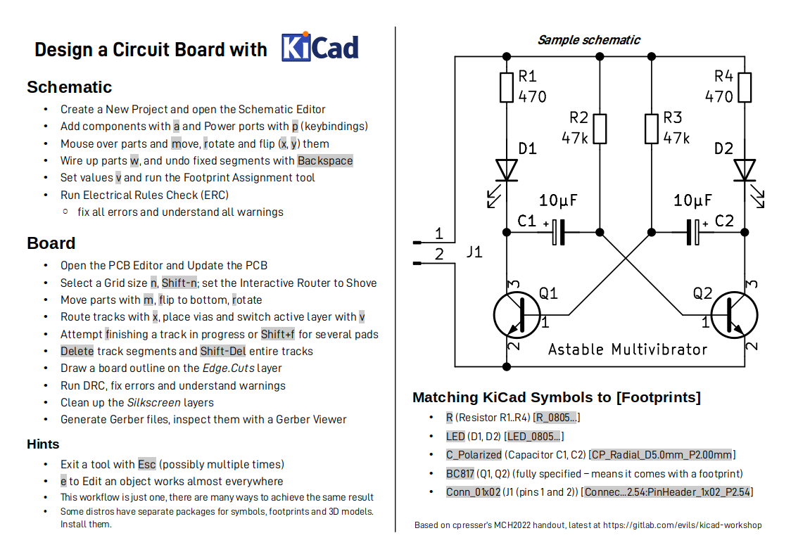

= KiCad Workshop Handout
Evils <evils.devils@protonmail.com>
:homepage: https://gitlab.com/evils/kicad-workshop
:license: CERN-OHL-W-2.0
:keywords: KiCad, workshop, handout, learn, schematic, capture, PCB, printed, circuit, board, layout, design, EDA, suite, DIY, electronics
:toc2:
:sectanchors:
:sectlinks:
:hardbreaks:
:hide-uri-scheme:

This handout is intended to be used in conjunction with an instructor giving a KiCad workshop.
It is based on cpresser's MCH2022 handout and should be valid for KiCad version 7.
This repo contains the source .odt file which embeds the D-DIN font it uses.
Plus a link:./handout.pdf[.pdf] and link:./handout.png[.png] render of that.
And the KiCad source for the example schematic.

== Additional materials
An older, elaborate workshop outline can be found in the `cmoy` branch here {homepage}.

notes:
first place the components in the schematic
then assign the footprints with the BOM tool (top right corner of toolbar)

use erc (electrical rule check) to verify there's no generator-generator connection (bad !!!)

use shift+space to change from hard angle to no angle in wiring mode

then open pcb design and press F8 to import the schematic to the pcb. you now have to do the routing by hand

move the parts with m, flip to bottom with f, rotate with r, wire with x

DRC -> checklist "exécuter les règles de vérification de pcb"

then file > gerber export > trace and open the .grbj (gerber job) with the integrated kicad gerber viewer

